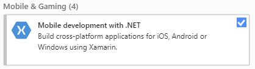
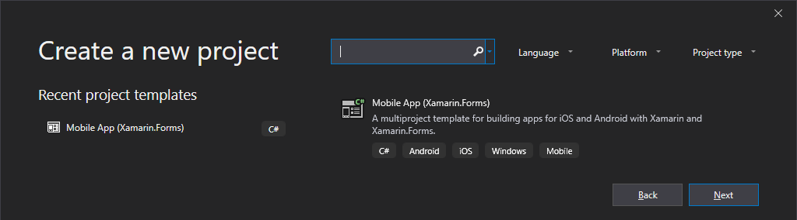
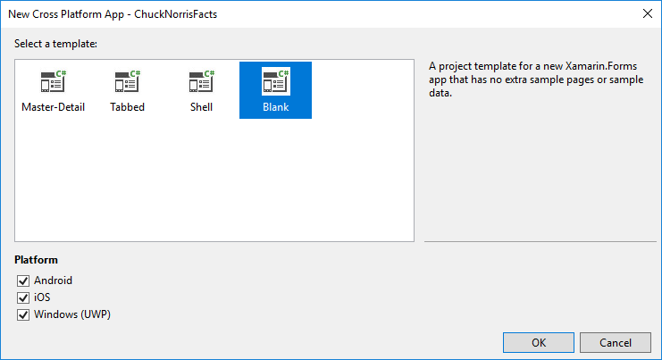
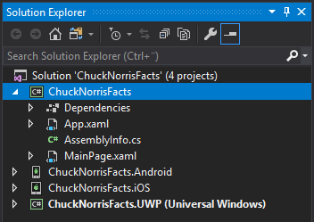
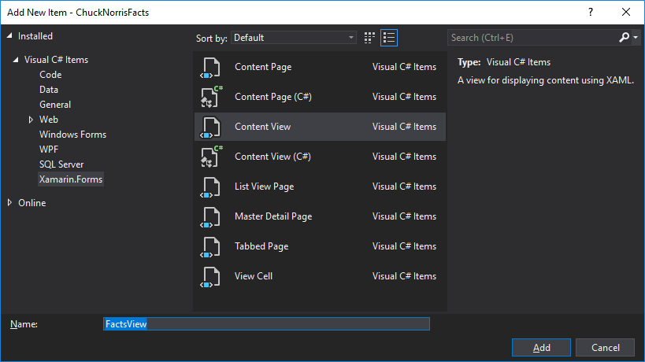
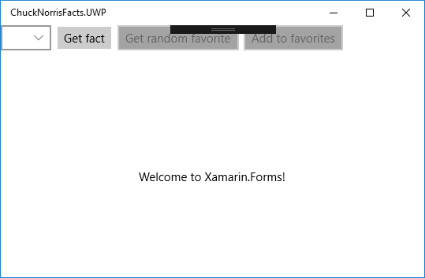

Chuck Norris could easily make an app that runs on iOS, Android and Windows without any frameworks or tools, 
but most of us others wouldn't do without. Xamarin Forms is such a great tools exactly enabling a single codebase
running on all three platforms. It comes free with Visual Studio 2019 community edition from Microsoft. 
Let's use it to make a simple app that can fetch and remember other hopefully entertaining facts about
Chuck Norris. 

Start by downloading Visual Studio 2019 community edition fom 
[__visualstudio.microsoft.com__](https://visualstudio.microsoft.com/).
Make sure to check the box "Mobile development" during the installation process:



If you forget, no problem! Just open "Visual Studio Installer" from your start menu, select __Modify__ and
then you are back at the screen where you can tick off "Mobile development".

You may also use Visual Studio 2017, but I would be wise to update it - to make sure
you have the last version of Xamarin.Forms. To update, start the Visual Studio 
installer and select Update if that is an option. 

Start Visual Studio, select __Create a new project__, and select the template __Mobile App (Xamarin.Forms)__:



Enter __ChuckNorrisFacts__ for __Project name__ and then click the button __Create__.

Then check all platforms and select the template __Blank__:



Then you're in. Have a look around!

The Solution Explorer on the right contains four projects:



The first one is the only one we will work on. The others are for platform 
specific code, and you may as well collapsed them as I have done in the image
above. 

Notice that the last project, ChuckNorrisFacts.UWP (Universal Windows) is in 
bold text. This means that hitting F5 will run this as a Windows application. 
If you want to run the Android or iOS versions, you must right-click the project
you want and then select __Set as StartUp Project__. 

Let's build a user interface for getting facts. Right click the project
__ChuckNorrisFacts__, select __Add__ and then __New Item...___.
Select __Xamarin.Forms__ to the left and __Content View__ in the middle, 
and enter "FactsView" in the Name-field:



Click __Add__, and a two new files will be created. FactsView.xaml is the view part
of the component, declaring which components are included and their visual appearence,
including layout. FactsView.xaml.cs is for C# and is called the code behind file. 

Change the file's content to this:

```xml
<?xml version="1.0" encoding="UTF-8"?>
<ContentView xmlns="http://xamarin.com/schemas/2014/forms" 
             xmlns:x="http://schemas.microsoft.com/winfx/2009/xaml"
             x:Class="ChuckNorrisFacts2.FactsView">
    <ContentView.Content>
        <StackLayout>
            <StackLayout Orientation="Horizontal">
                <Picker x:Name="CategoryPicker"></Picker>
                <Button x:Name="GetFactButton" Clicked="GetFactClicked" Text="Get fact"></Button>
                <Button x:Name="GetFavoriteButton" Clicked="GetFavoriteClicked" Text="Get random favorite" IsEnabled="False"></Button>
                <Button x:Name="AddFavoriteButton" Clicked="AddFavoriteClicked" Text="Add to favorites" IsEnabled="False"></Button>
            </StackLayout>
            <Label x:Name="FactLabel"/>
        </StackLayout>
    </ContentView.Content>
</ContentView>
```

The content of this view is a `StackLayout`, which by defaut lays out its content
from top to botton. In the first row is another `StackLayout` with 
`Orientation="Horizontal"`, which means it lay out its content from left to right.
Inside it there are a combobox (which is called `Picker` in Xamarin.Forms) and three
buttons. 

The `x:Name` attribute gives a variable name to each component. This enables you
to access them in th code behind file. You will see that soon. 

The `Clicked` attribute names which method in the code behind file is to be called
then the button is clicked. The attribute `Text` specifies the text to be shown on the 
button. 

The to last buttons are disbled, because we want to reserve this functionality to
users who have logged in. More about that later. 

It is always wise to often test that you have done everything right. To actually
see our FactsVie, open `MainPage.xaml` and add `<local:FactsView></local:FactsView>`
 right after the comment `<!-- Place new controls here -->`. Also, to make it 
build without errors, we need to add the click-handlers. Open `FactsView.xaml.cs`
and add this to the class:

```cs
private void GetFavoriteClicked(object sender, EventArgs e)
{
}

private void GetFactClicked(object sender, EventArgs e)
{
}

private void AddFavoriteClicked(object sender, EventArgs e)
{
}
```

Now you can press F5, and Visual Studio will
build your solution and run it. Building it takes a while the first time.
When started, it should look like this:



The black thing, in the center almost at the top, is a debug tool. Click on it
and it will expand. If you run with ctrl+F5 instead of only F5, Visual Studio will
run your app without debug mode and without this debug tool. 

Next up is actually getting some Chuck Norris Facts! That's where Chuck Norris facts
JSON API at https://api.chucknorris.io/ comes in handy. Go to https://api.chucknorris.io/jokes/random
and you will get a random joke in JSON format. We need to build a model class to 
parse this JSON. Let's do it the easy way. Copy the JSON of the random joke you got
from the browser. Then add a new class, either by the shortcut Shift+Alt+C or
by right clicking the project__ChuckNorrisFacts__, selecting  __Add__ and then 
__New Item...___. Call the class `Fact`. Once it has been created, the class
and the using statements so you are left with only this:


```cs
namespace ChuckNorrisFacts
{
}
``

Place the cursor in between the curly braces and go to the __Edit__ menu in the 

top bar of Visual Studio. Select __Paste Special__ and then __Paste JSON as Classes__.
Visual Studio creates all the properties for you! 
Change the name of the class to `Fact`, and it should now look like this:

```cs
namespace ChuckNorrisFacts
{
    public class Fact
    {
        public object category { get; set; }
        public string icon_url { get; set; }
        public string id { get; set; }
        public string url { get; set; }
        public string value { get; set; }
    }

}
``


