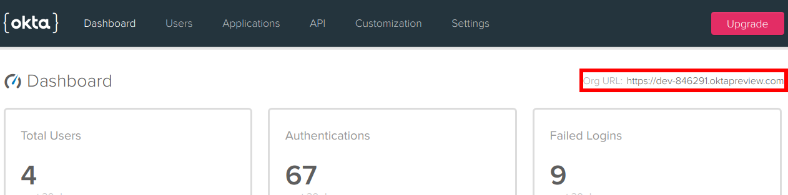

Chuck Norris could easily makes a single app run on every platform: 
iOS, Android, and Windows - without any frameworks or tools. 
Most others could do with some help. Xamarin Forms is a perfect help, and
makes it a breeze to create an app! You can create an app
for all three platforms from a single codebase. It comes free with 
Visual Studio 2019 community edition from Microsoft. 
Let's try it out - and have some fun. You will use it to make a simple app that 
can entertain with facts 
about Chuck Norris. You will use these tools, libraries, and services:

- Visual Studio 2019 community edition
- Xamarin.Forms
- RestSharp - for REST calls from C#
- Okta.Auth.Sdk - for authenticating users
- Chuck Norris facts API at https://api.chucknorris.io/

# Get the tool
Start by downloading Visual Studio 2019 community edition from 
[__visualstudio.microsoft.com__](https://visualstudio.microsoft.com/).
Make sure to check the box "Mobile development" during the installation process:


If you forget, no problem! Just open "Visual Studio Installer" from your start menu, select __Modify__ and
then you are back at the screen where you can tick off "Mobile development".

You may also use Visual Studio 2017, but it would be wise to update it - to make sure
you have the latest version of Xamarin.Forms. Start the Visual Studio 
installer and select Update if that is an option. 

# Start making your app
Start Visual Studio, select __Create a new project__, and select the template __Mobile App (Xamarin.Forms)__:


Enter __ChuckNorrisFacts__ for __Project name__ and then click the button __Create__.

Then check all platforms and select the template __Blank__:


Then you're in. Have a look around!

The Solution Explorer on the right contains four projects:


The first one is the only one you will work on. The others are for 
platform-specific code, and you may as well collapse them as I have done in the image
above. 

Notice that the last project, ChuckNorrisFacts.UWP (Universal Windows) is in 
bold text. This means that hitting F5 will run this as a Windows application. 
If you want to run the Android or iOS versions, you must right-click the project
you want and then select __Set as StartUp Project__. 

Let's build a user interface for getting Chuck Norris facts! Right-click the project
__ChuckNorrisFacts__, select __Add__ and then __New Item...__.
Select __Xamarin.Forms__ to the left and __Content View__ in the middle, 
and enter "FactsView" in the Name-field:


Click __Add__, and two new files will be created. `FactsView.xaml` is the view part
of the component, declaring which components are included and their visual 
appearance,
including layout. `FactsView.xaml.cs` is for C# and is called the _code behind file_. 

Change the file's content to this:

```xml
<?xml version="1.0" encoding="UTF-8"?>
<ContentView xmlns="http://xamarin.com/schemas/2014/forms" 
             xmlns:x="http://schemas.microsoft.com/winfx/2009/xaml"
             x:Class="ChuckNorrisFacts2.FactsView">
    <ContentView.Content>
        <StackLayout>
            <StackLayout Orientation="Horizontal">
                <Picker x:Name="CategoryPicker"></Picker>
                <Button x:Name="GetFactButton" Clicked="GetFactClicked" Text="Get fact"></Button>
                <Button x:Name="GetFavoriteButton" Clicked="GetFavoriteClicked" 
                          Text="Get random favorite" IsEnabled="False"></Button>
                <Button x:Name="AddFavoriteButton" Clicked="AddFavoriteClicked" 
                          Text="Add to favorites" IsEnabled="False"></Button>
            </StackLayout>
            <Label x:Name="FactLabel"/>
        </StackLayout>
    </ContentView.Content>
</ContentView>
```

The content of this view is a `StackLayout`, which by default lays out its content
from top to bottom. In the first row is another `StackLayout` with 
`Orientation="Horizontal"`, which means it lays out its content from left to right.
Inside it, there are a combo box (which is called `Picker` in Xamarin.Forms) and three
buttons. 

The `x:Name` attribute gives a variable name to each component, which enables 
you to access them in the code behind file. You will see that soon. 

The `Clicked` attribute tells which method be called
when the button is clicked. The attribute `Text` specifies the text on the 
button. 

The two last buttons are disabled, more about that later. 

# Run the first version of your app

It is always wise to often test that everything is right. To actually
see our `FactsView`, open `MainPage.xaml` and add `<local:FactsView></local:FactsView>`
 right after the comment `<!-- Place new controls here -->`. Also, to make it 
build without errors, you need to add the click-handlers. Open `FactsView.xaml.cs`
and add these methods to the class - we will finish them later:

```cs
private void GetFavoriteClicked(object sender, EventArgs e)
{
}

private void GetFactClicked(object sender, EventArgs e)
{
}

private void AddFavoriteClicked(object sender, EventArgs e)
{
}
```

Now you can press F5, and Visual Studio will
build your solution and run it. Building it takes a while the first time.
When started, it should look something like this:


The black thing in the center almost at the top is a debug tool. Click on it
to expand it. If you run with ctrl+F5 instead of only F5, Visual Studio will
run your app without debug mode and without this debug tool. 

# Make a REST call

Next up is actually getting some Chuck Norris Facts! That's where Chuck Norris facts
JSON API at https://api.chucknorris.io/ comes in handy. Go to https://api.chucknorris.io/jokes/random
and you will get a random joke in JSON format. 

You need to build a model class to 
parse this JSON. Let's do it the easy way. Copy the JSON of the random joke you got
from the browser. Then add a new class, either by the shortcut **Shift+Alt+C**
 or by right-clicking the project __ChuckNorrisFacts__, selecting  __Add__ and then 
__New Item...__. Call the class `Fact`. Once it has been created, _delete_ the class
and the using statements so you are left with only this:


```cs
namespace ChuckNorrisFacts
{
}
```

Place the cursor between the curly braces and go to the __Edit__ menu in the 
top bar of Visual Studio. Select __Paste Special__ and then __Paste JSON as Classes__.
Visual Studio creates all the properties for you! 
Change the name of the class back to `Fact`, and it should now look like this:

```cs
namespace ChuckNorrisFacts
{
    public class Fact
    {
        public object category { get; set; }
        public string icon_url { get; set; }
        public string id { get; set; }
        public string url { get; set; }
        public string value { get; set; }
    }
}
```

Now you will add some NuGet packages to do REST calls and parse JSON.
Go to the __Tools__ menu at the top bar of Visual Studio. Select
__NuGet Package Manager__ and then __Manager NuGet Packages for Solution__. 
Install `RestSharp` and `Newtonsoft.JSON` into the main project, ChuckNorrisFacts.

Now you can finish `FactsView.xaml.cs`. Add these two using-statements
at the top:

```cs
using Newtonsoft.Json;
using RestSharp;
```

Add the two object variables from the code below - and also the initialization 
code at the end of the constructor:

```cs
public partial class FactsView : ContentView
{
    private readonly List<string> _favorites = new List<string>();
    private readonly RestClient _client = new RestClient("https://api.chucknorris.io");

    public FactsView()
    {
        InitializeComponent();

        var categoryList = new List<string> { "Random" };
        categoryList.AddRange(GetCategories());
        CategoryPicker.ItemsSource = categoryList;
        CategoryPicker.SelectedIndex = 0;
    }

```

The list is for saving your favorite Chuck Norris Facts in-memory, and
`_client` is for an object that will help us to do REST calls. 

In the constructor add options to the `Picker`. The first option
is to have a random fact, and the rest are the categories you will fetch from 
https://api.chucknorris.io/jokes/categories with a REST call. 

Next, fill `GetFactClicked` with this:

```cs
private void GetFactClicked(object sender, EventArgs e)
{
    var isRandom = CategoryPicker.SelectedIndex == 0;
    FactLabel.Text = GetFact(isRandom ? null : CategoryPicker.SelectedItem.ToString());
}
```

You will make a method `GetFact()` that can take a category name as
a parameter and get a fact 
in that category - or get a random fact of no category is provided. 

To make `GetFact()` and `GetCategories()` actually work, add this:

```cs
public string GetFact(string category = null)
{
    var url = "/jokes/random";
    if (category != null) url += "?category=" + category;
    var fact = Get<Fact>(url);
    return fact?.value;
}

public string[] GetCategories()
{
    return Get<string[]>("/jokes/categories");
}

private T Get<T>(string url)
{
    var request = new RestRequest(url, Method.GET);
    var response = _client.Execute(request);
    return JsonConvert.DeserializeObject<T>(response.Content);
}
```

The last one is a helper method which gets a URL as a parameter, does the REST call, 
converts the result to datatype `T`. To make this as general as possible, you use _generics_, 
that's the `<T>` in `Get<T>` and it lets you call this method with whatever class you want. 

`GetCategories()` simply calls the helper method with the correct URL ending - and asks for
the results to be interpreted as a string array. 

`GetFact()` does something similar. If a category is set, it adds it to the URL the way that
the Chuck Norris API wants it. And it wants the result as an object of the class you made earlier, 
`Fact`.

The logic for favorites simply works with the in-memory list. Add their implementations:

```cs
private void GetFavoriteClicked(object sender, EventArgs e)
{
    FactLabel.Text = _favorites.Count == 0
        ? "You have no favorites yet."
        : _favorites[new Random().Next(0, _favorites.Count)];
}

private void AddFavoriteClicked(object sender, EventArgs e)
{
    _favorites.Add(FactLabel.Text);
}
```

`AddFavoriteClicked()` will add the current fact to the favorites list. 
`GetFavoriteClicked()` will show a random favorite, if not the list is empty, in which case
it lets the user know there are no favorites yet. 

But wait - those buttons are disabled! Sure, you can enable them, but you don't want users to see
anything other than their own favorites. So you need a way to ensure that the user is who he or she
claims to be.

# Add authentication to your Xamarin.Forms app

No reason to write the authentication yourself. 
You can easily integrate Okta to handle the authentication for you and easily:

 - [Authenticate](https://developer.okta.com/product/authentication/) and 
   [authorize](https://developer.okta.com/product/authorization/)  your users
 - Store data about your users
 - Perform password-based and [social login](https://developer.okta.com/authentication-guide/social-login/)
 - Secure your application with [multi-factor authentication](https://developer.okta.com/use_cases/mfa/)
 - And much more! Check out our [product documentation](https://developer.okta.com/documentation/)
 - Sign up for a [forever-free developer account](https://developer.okta.com/signup/) (or log in if you already have one).
 
Once you have signed up and logged in, you’ll be taken to your dashboard. Make note of your Org URL in the top right corner.



Then install the `Okta.Auth.Sdk` NuGet package, and create a new login 
component.  Right-click the project __ChuckNorrisFacts__, select __Add__ and then __New Item...__.
Select __Xamarin.Forms__ to the left and __Content View__ in the middle, 
and enter "LoginView" in the Name-field. Click __Add__.

Open `LoginView.xaml` and change its content to this:
```xml
<?xml version="1.0" encoding="UTF-8"?>
<ContentView xmlns="http://xamarin.com/schemas/2014/forms" 
             xmlns:x="http://schemas.microsoft.com/winfx/2009/xaml"
             x:Class="ChuckNorrisFacts.LoginView">
    <ContentView.Content>
        <StackLayout>
            <StackLayout x:Name="LoginPanel">
                <Entry x:Name="EmailEntry" Placeholder="Email" ></Entry>
                <Entry x:Name="PasswordEntry" Placeholder="Password" IsPassword="True" ></Entry>
                <Button Clicked="LoginClicked" Text="Login"></Button>
                <Button Clicked="SignupClicked" Text="Signup"></Button>
                <Label x:Name="ErrorLabel" TextColor="#FF0000"></Label>
            </StackLayout>
            <StackLayout x:Name="LogoutPanel" IsVisible="False" Orientation="Horizontal">
                <Label Text="You are logged in." ></Label>
                <Button Clicked="LogoutClicked" Text="Logout"></Button>
            </StackLayout>
        </StackLayout>
    </ContentView.Content>
</ContentView>
```

So you have made a log in panel and a log out panel. Only one of them will be visible at a time. 
The log in panel has two textboxes for email and password. `Entry` is a textbox in Xamarin.Forms.
You have also made one button for logging in, one for signing up and a label to show a message
if the login fails. The log out panel only shows a label and a button to log out.

You will make `LoginView` fire an event when the user has logged in. `FactsView` will listen to 
and react to this event. Open `LoginViw.xaml.cs` and add the following line to the class:

```cs
public event EventHandler<bool> LoginChanged;
```

At the top you need to add these two using statements:

```cs
using Okta.Auth.Sdk;
using Okta.Sdk.Abstractions.Configuration;
``` 

Then add this method to handle a click on the login button:

```cs
private async void LoginClicked(object sender, EventArgs e)
{
    var success = await Login(EmailEntry.Text, PasswordEntry.Text);
    if (LoginChanged != null) LoginChanged(this, success);
    if (success)
    {
        LoginPanel.IsVisible = false;
        LogoutPanel.IsVisible = true;
        ErrorLabel.Text = "";
    }
    else
    {
        ErrorLabel.Text = "Login failed.";
    }
}
```

It calls another method `Login()` to do the authentication, sending it the email address
and password that the user has entered. It fires an event, which we will later 
work on in  `FactsView`. On success, it shows the log out panel and hides the log in panel. If the login
fails it shows an error message. 

Now add the method `Login()` which does the authentication:

```cs
public static async Task<bool> Login(string email, string password)
{
    var config = new OktaClientConfiguration { OktaDomain = "yourOktaDomain", };
    var authClient = new AuthenticationClient(config);

    var authnOptions = new AuthenticateOptions { Username = email, Password = password };
    try
    {
        var authnResponse = await authClient.AuthenticateAsync(authnOptions);
        return authnResponse.AuthenticationStatus == AuthenticationStatus.Success;
    }
    catch
    {
        return false;
    }
}
```

This method simply sends the username and password to Okta for authentication. In the first line, make sure the property `OktaDomain` is set to the value in your dashboard
when logged in to the okta web site. 

To actually test this, you must add a user. Select **Users** > **People** from the Okta web dashboard and then
**Add Person**. Okta also provides a separate sign up page for you. It has the URL 
`yourOktaDomain/signin/register`. In the app, the sign up button will open a browser with
this URL. Add the method below:

```cs
private void SignupClicked(object sender, EventArgs e)
{
    Device.OpenUri(new Uri("yourOktaDomain/signin/register"));
}
```

Also, add a method to handle log out:

```cs
private void LogoutClicked(object sender, EventArgs e)
{
    LoginPanel.IsVisible = true;
    LogoutPanel.IsVisible = false;
    if (LoginChanged != null) LoginChanged(this, false);
}
```

It hides the log out panel, shows the log in panel and fires the event. 

# Send notifications from one view to another

To show `LoginView` and make the event work, open `MainPage.xaml` and
change the content of the `StackLayout` to this:

```xml
<local:FactsView x:Name="FactsView"></local:FactsView>
<local:LoginView x:Name="LoginView" LoginChanged="HandleLoginChanged"></local:LoginView>
```

The main page will have both a `FactsView` and a `LoginView`. The event
will be handled by a method `HandleLoginChanged`. Open `MainPage.xaml.cs` and
add this:

```cs
private void HandleLoginChanged(object sender, bool isLoggedIn)
{
    FactsView.HandleLoginChanged(isLoggedIn);
}
```

When the event occurs this code just passes it on to `FactsView`. Open `FactsView.xaml.cs`
and add this: 

```cs
public void HandleLoginChanged(bool isLoggedIn)
{
    AddFavoriteButton.IsEnabled = GetFavoriteButton.IsEnabled = isLoggedIn;
}
```

It will enable or disable to favorite buttons depending on if you are logged in or not. 

Now run the app with ctrl-F5 or F5 and start collecting your favorite Chuck Norris Facts!